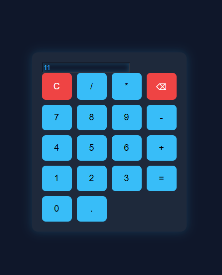

# 🔢 Calculator App

A modern calculator web application built using HTML, CSS, and JavaScript with a clean and responsive user interface.

---

## 🚀 Features
- ➕ Addition, ➖ Subtraction, ✖️ Multiplication, ➗ Division
- 🎨 Clean dark-themed UI
- ⚡ Smooth button animations
- 🧠 Real-time calculations
- ❌ Clear and delete functionality

---

## 🛠️ Technologies Used
- HTML
- CSS
- JavaScript

---

## 📸 Preview

---

## 📂 Project Structure
calculator-app/
│── index.html
│── style.css
│── script.js
│── screenshot.png

---

## 🔗 Live Demo
https://archanareddy3640.github.io/calculator-app/

---

## 🙌 Author
- GitHub: https://github.com/archanareddy3640
